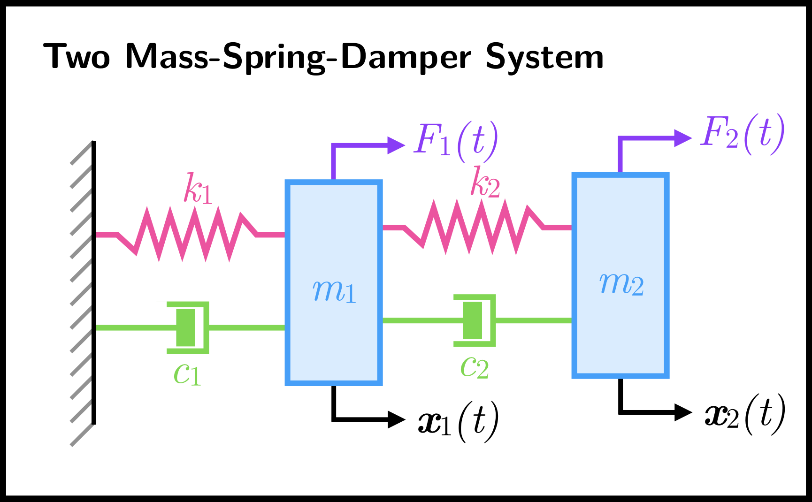

# System Identification Technologies
The special purpose of system identification corresponds to identifying a mathematical model describing a relationship between the input and output of a real system. Recent developments in the field of system identification have provided effective and accurate analytical tools to solve challenging problems in system engineering and virtually in any application concerning models of dynamic systems. This project aims to present the fundamental algorithms of time-domain system identification for linear time-invariant systems.


## Installation
Directly download the zip file or clone the project:
```bash
git clone https://github.com/SystemIDTechnologies/SystemIDTechnologies.git
```

## Usage
Five systems are currently implemented: one, two, three mass spring damper systems, a simulated automobile system and a customized system. For simplicity, each system has his own file: `Main_1Mass.py`, `Main_2Mass.py`, `Main_3Mass.py`, `Main_Automobile.py`, `Main_Custom.py`. Each file is highly customable. Schematic descriptions of the systems are in the Images folder.

## Example
Let's study the Two Mass Spring Damper System.
<p align="center">
  
</p>

### 1. Initial Condition, Input Signal and Measurement Noise
After libraries imports, one must choose an initial condition type, an input signal, the frequency and total length of the input signal as well as a signal to noise ratio for measurement noise (if `True`):

```python
## Initial Condition type, Input Signal parameters and Noise
initialCondition = 'Random'
inputSignalName = 'White Noise'
frequency = 5
total_time = 50
noise = True
snr = 1e8
```

By default, the initial condition is set to be random and the input signal is a white noise of frequency 5 for a total of 50 seconds. Some white noise is added to the measurements with a snr of 1e8.
Initial condition can be random (`'Random'`) or zero (`'Zero'`) or customized later.
